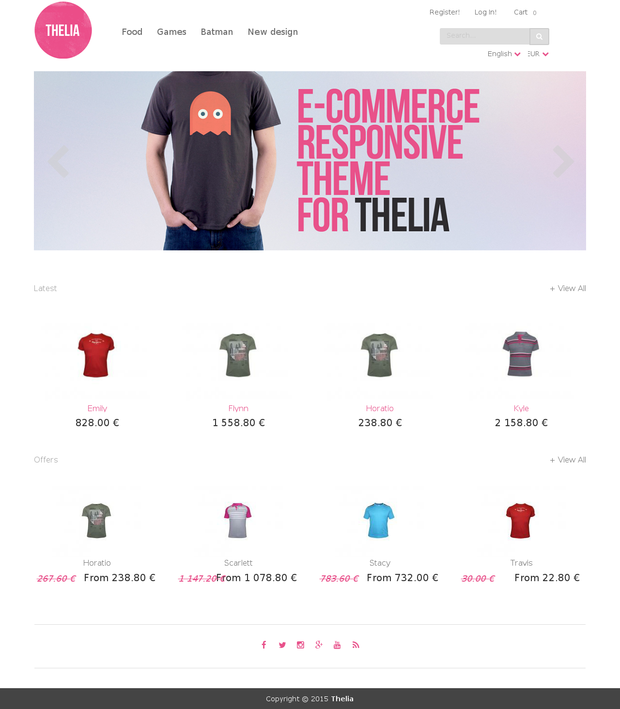
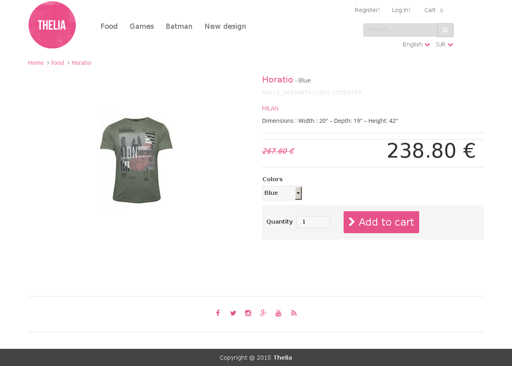

# Wiggum

Wiggum is a template for [Thelia](http://thelia.net) ecommerce solution

## Installation

This template just change the assets of the default Thelia's template.

You have 2 choices for installing this template :

### The safe way

* Copy and Paste the default template and name wiggum
* replace the assets directory by the assets directory of this repo.
* Don't forget to change the activated template
* edit the ```layout.tpl``` file and replace ```{default_translation_domain domain='fo.default'}``` by ```{default_translation_domain domain='fo.wiggum'}```.

### The lazy way

* replace the assets directory contained in the default template by the assets directory of this repo.

**Be careful, by using this method you can loose all your modifications if you update the default template**

## Screenshots




